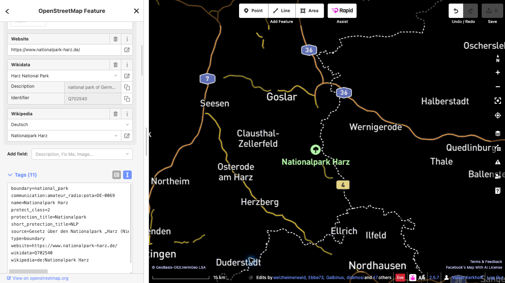

# Eine POTA-Referenz zu OpenStreetMap hinzufügen

Diese Anleitung zeigt, wie ein vorhandenes OpenStreetMap-Objekt (OSM) eines Schutzgebiets mit seiner Parks-on-the-Air-Referenz (POTA) verknüpft wird.

## Beispiel dieser Anleitung

**Nationalpark Harz** — POTA-ID **DE-0069**. Prüfe das Gebiet in der [offiziellen POTA-Parkseite](https://pota.app/#/park/DE-0069).

## Vor dem Start

Zum Hochladen von Änderungen benötigst du ein aktives OpenStreetMap-Konto. Falls du noch keines hast, [registriere zuerst ein OSM-Konto](https://www.openstreetmap.org/user/new) und melde dich anschließend an. Diese Anleitung verwendet den browserbasierten iD-Editor.

## Schritte

1. **Gebiet prüfen.** Suche den Nationalpark Harz in OSM und prüfe Name, Ausdehnung und vorhandene Tags des Objekts, das das gesamte Schutzgebiet darstellt. Ein Schutzgebiet kann als Multipolygon-Relation oder als geschlossener Weg erfasst sein.
2. **Das Gesamtobjekt auswählen.** Zoome im iD-Editor heran und wähle die Fläche des Parks aus. Falls du einen Mitgliedsweg ausgewählt hast, öffne die Relation, die das Schutzgebiet darstellt. Füge den Tag nicht allen Grenzwegen hinzu.
3. **Einen Tag hinzufügen.** Öffne im Objektbereich **Alle Tags** (die Bezeichnung kann je nach iD-Version leicht abweichen) und ergänze genau:

   `communication:amateur_radio:pota=DE-0069`

   Ändere keine vorhandenen Tags und keine Geometrie. Lege keinen neuen Punkt oder Umriss für den POTA-Code an. Gibt es bereits einen POTA-Tag oder ist das Objekt nicht eindeutig, halte an und frage die lokale OSM-Community.

   

4. **Entwurf speichern und prüfen.** Klicke auf **Speichern**, um den Upload-Bereich zu öffnen. Lies die vollständige Liste der ausstehenden Änderungen und prüfe, ob sie nur den vorgesehenen POTA-Tag am richtigen Schutzgebiet enthält. Gib einen aussagekräftigen Änderungssatz-Kommentar ein, zum Beispiel: `POTA-Referenz DE-0069 zum Nationalpark Harz hinzufügen`.
5. **Abschließend bestätigen.** Prüfe vor dem Upload, ob das ausgewählte Objekt das gesamte Schutzgebiet darstellt, Schlüssel und Wert genau `communication:amateur_radio:pota=DE-0069` lauten und weder Geometrie noch andere Tags geändert wurden. Lies alle Warnhinweise. Falls etwas unerwartet ist, brich ab und korrigiere den Entwurf. Wenn alles stimmt, klicke auf **Hochladen**, um die Änderung öffentlich in OSM zu veröffentlichen. Das Hochladen ist die endgültige öffentliche Bestätigung.
6. **Veröffentlichte Änderung prüfen.** Sobald iD den erfolgreichen Upload meldet, öffne das Objekt in OSM erneut und kontrolliere den Tag. Bei einem Fehler folge der angezeigten Meldung und wiederhole den Upload erst nach erneuter Prüfung. Die POTA-Karte wird eventuell erst später aktualisiert.

## Links

- [Offizielle POTA-Parkseite DE-0069](https://pota.app/#/park/DE-0069)
- [Schutzgebiet in OpenStreetMap](https://www.openstreetmap.org/relation/90584)
- [Öffentliche Bestätigung des Changesets](https://www.openstreetmap.org/changeset/189121822)
- [OpenStreetMap-Konto erstellen](https://www.openstreetmap.org/user/new)
- [OpenStreetMap-Wiki: `communication:amateur_radio`](https://wiki.openstreetmap.org/wiki/Key:communication:amateur_radio)
