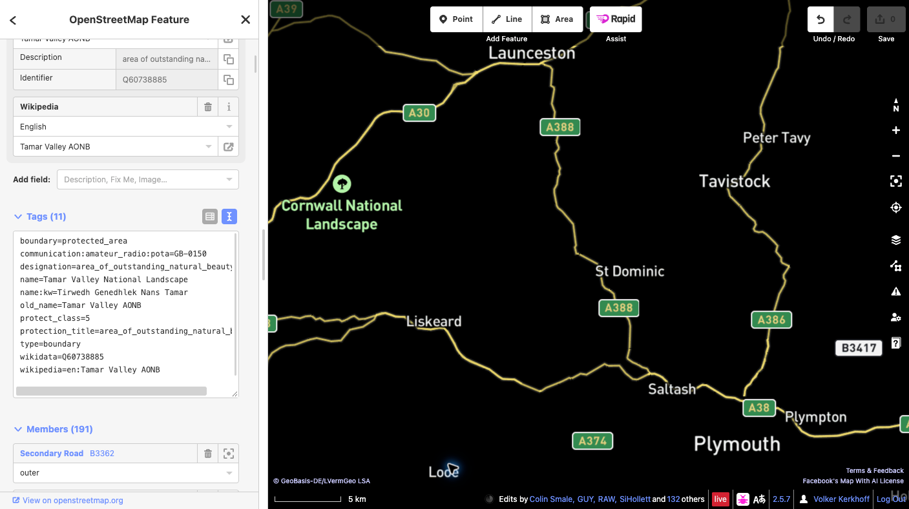

# Add a POTA reference to OpenStreetMap

This guide explains how to link an existing OpenStreetMap (OSM) park feature to its Parks on the Air (POTA) reference.

## Example in this guide

**Tamar Valley National Landscape** — POTA ID **GB-0150**. Confirm the park using the [official POTA listing](https://pota.app/#/park/GB-0150) and the [OSM relation](https://www.openstreetmap.org/relation/10773241).

## Before you start

You need an active OpenStreetMap account to upload changes. If you do not have one, [register for an OSM account first](https://www.openstreetmap.org/user/new), then sign in. This guide uses the browser-based iD editor.

## Steps

1. **Confirm the park.** Open the [Tamar Valley National Landscape relation in OSM](https://www.openstreetmap.org/relation/10773241) and check the name, extent, and existing tags of the feature that represents the whole protected site. A protected area may be mapped as a multipolygon relation or a closed way.
2. **Select the whole feature.** In iD, zoom in and select the park area. If you selected a member way, open the relation representing the protected site. Do not add the tag to every boundary member.
3. **Add one tag.** In the feature panel, open **All tags** (the wording may vary slightly by iD version) and add exactly:

   `communication:amateur_radio:pota=GB-0150`

   Leave existing tags and geometry unchanged. Do not create a new point or boundary for the POTA code. If a POTA tag already exists or the feature is unclear, stop and ask the local OSM community for advice.

   

4. **Save the draft and review it.** Click **Save** to open the upload panel. Read the complete list of pending changes and check that it contains only the intended POTA tag on the correct park feature. Enter a descriptive changeset comment, for example: `Add POTA reference GB-0150 to Tamar Valley National Landscape`.
5. **Make the final confirmation.** Before uploading, confirm the selected feature is the whole protected site, the key and value are exactly `communication:amateur_radio:pota=GB-0150`, and no geometry or unrelated tags changed. Read any warnings. If anything is unexpected, cancel and correct the draft. When everything is correct, click **Upload** to publish the edit to OSM. Uploading is the final public confirmation.
6. **Verify the published edit.** After iD reports a successful upload, open the feature in OSM and confirm the tag is present. If the upload fails, follow the displayed error and retry only after reviewing the changes again. The POTA map may take a little time to refresh.

## Links

- [Official POTA listing GB-0150](https://pota.app/#/park/GB-0150)
- [OpenStreetMap relation 10773241](https://www.openstreetmap.org/relation/10773241)
- [Public changeset confirmation](https://www.openstreetmap.org/changeset/189121853)
- [Create an OpenStreetMap account](https://www.openstreetmap.org/user/new)
- [OpenStreetMap Wiki: `communication:amateur_radio`](https://wiki.openstreetmap.org/wiki/Key:communication:amateur_radio)
