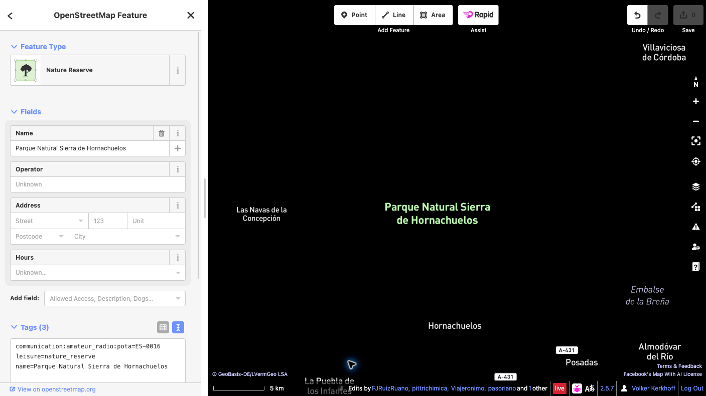

# Añadir una referencia POTA a OpenStreetMap

Esta guía muestra cómo vincular un parque existente de OpenStreetMap (OSM) con su referencia de Parks on the Air (POTA).

## Ejemplo de esta guía

**Parque Natural Sierra de Hornachuelos** — referencia POTA **ES-0016**. Comprueba el parque en la [ficha oficial de POTA](https://pota.app/#/park/ES-0016).

## Antes de empezar

Necesitas una cuenta activa de OpenStreetMap para subir cambios. Si aún no tienes una, [regístrate primero](https://www.openstreetmap.org/user/new) y después inicia sesión. Esta guía usa el editor iD, que funciona en el navegador.

## Pasos

1. **Confirma el parque.** Busca Sierra de Hornachuelos en OSM y comprueba el nombre, el ámbito y las etiquetas del elemento existente que representa el parque completo. Un espacio protegido puede estar mapeado como una relación multipolígono o como una vía cerrada.
2. **Selecciona el elemento completo.** En iD, acerca el mapa y selecciona el área del parque. Si has seleccionado una vía miembro, abre la relación que representa el espacio protegido. No añadas la etiqueta a todas las vías límite.
3. **Añade una sola etiqueta.** En el panel del elemento, abre **Todas las etiquetas** (el texto puede variar según la versión de iD) y añade exactamente:

   `communication:amateur_radio:pota=ES-0016`

   No cambies las etiquetas existentes ni la geometría. No crees un punto o un límite nuevo para el código POTA. Si ya hay una etiqueta POTA o el elemento no está claramente identificado, detente y pide consejo a la comunidad OSM local.

   

4. **Guarda el borrador y revísalo.** Pulsa **Guardar** para abrir el panel de subida. Lee la lista completa de cambios y comprueba que solo contiene la etiqueta POTA prevista en el elemento correcto. Escribe un comentario descriptivo, por ejemplo: `Añadir referencia POTA ES-0016 al Parque Natural Sierra de Hornachuelos`.
5. **Haz la confirmación final.** Antes de subir, confirma que el elemento seleccionado representa todo el espacio protegido, que la clave y el valor son exactamente `communication:amateur_radio:pota=ES-0016` y que no han cambiado la geometría ni otras etiquetas. Lee cualquier aviso. Si algo no coincide, cancela y corrige el borrador. Cuando todo sea correcto, pulsa **Subir** para publicar el cambio en OSM. La subida es la confirmación pública definitiva.
6. **Verifica el cambio publicado.** Cuando iD confirme que la subida se ha realizado, abre el elemento en OSM y comprueba que aparece la etiqueta. Si falla, sigue el mensaje de error y vuelve a intentarlo solo después de revisar los cambios. El mapa POTA puede tardar un poco en actualizarse.

## Enlaces

- [Ficha oficial POTA ES-0016](https://pota.app/#/park/ES-0016)
- [Elemento del parque en OpenStreetMap](https://www.openstreetmap.org/way/374499973)
- [Confirmación pública del cambio](https://www.openstreetmap.org/changeset/189122070)
- [Crear una cuenta de OpenStreetMap](https://www.openstreetmap.org/user/new)
- [Wiki de OpenStreetMap: `communication:amateur_radio`](https://wiki.openstreetmap.org/wiki/Key:communication:amateur_radio)
