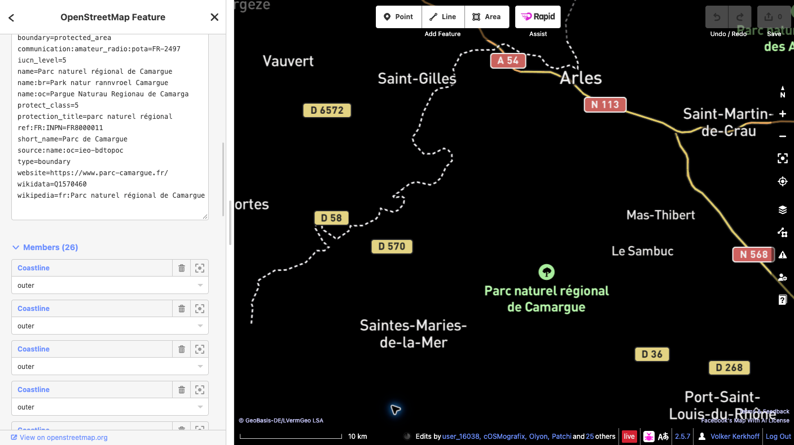

# Ajouter une référence POTA à OpenStreetMap

Ce guide explique comment associer un objet OpenStreetMap (OSM) existant représentant un espace protégé à sa référence Parks on the Air (POTA).

## Exemple de ce guide

**Parc naturel régional de Camargue** — identifiant POTA **FR-2497**. Vérifiez le site sur la [fiche officielle POTA](https://pota.app/#/park/FR-2497) et la [relation OSM](https://www.openstreetmap.org/relation/5393067).

## Avant de commencer

Un compte OpenStreetMap actif est nécessaire pour envoyer des modifications. Si vous n’en avez pas, [créez d’abord un compte OSM](https://www.openstreetmap.org/user/new), puis connectez-vous. Ce guide utilise l’éditeur iD dans le navigateur.

## Étapes

1. **Vérifiez le site.** Ouvrez la [relation du Parc naturel régional de Camargue dans OSM](https://www.openstreetmap.org/relation/5393067) et vérifiez le nom, l’étendue et les tags existants de l’objet représentant l’ensemble de la zone protégée. Une zone protégée peut être cartographiée sous forme de relation multipolygone ou de chemin fermé.
2. **Sélectionnez l’objet complet.** Dans iD, zoomez et sélectionnez la zone du parc. Si vous avez sélectionné un chemin membre, ouvrez la relation représentant l’espace protégé. N’ajoutez pas le tag à chacun des chemins de limite.
3. **Ajoutez un seul tag.** Dans le panneau de l’objet, ouvrez **Tous les tags** (le libellé peut légèrement varier selon la version d’iD) et ajoutez exactement :

   `communication:amateur_radio:pota=FR-2497`

   Ne modifiez ni les tags existants ni la géométrie. Ne créez pas de nouveau point ou contour pour le code POTA. Si un tag POTA existe déjà ou si l’objet n’est pas clairement identifié, arrêtez-vous et demandez conseil à la communauté OSM locale.

   

4. **Enregistrez le brouillon et relisez-le.** Cliquez sur **Enregistrer** pour ouvrir le panneau d’envoi. Lisez la liste complète des changements en attente et vérifiez qu’elle ne contient que le tag POTA prévu sur le bon objet. Saisissez un commentaire descriptif, par exemple : `Ajout de la référence POTA FR-2497 au Parc naturel régional de Camargue`.
5. **Confirmez l’envoi final.** Avant l’envoi, vérifiez que l’objet sélectionné représente tout le site protégé, que la clé et la valeur sont exactement `communication:amateur_radio:pota=FR-2497` et qu’aucune géométrie ni aucun autre tag n’a été modifié. Lisez les avertissements éventuels. Si quelque chose est inattendu, annulez et corrigez le brouillon. Lorsque tout est correct, cliquez sur **Envoyer** pour publier la modification dans OSM. Cet envoi constitue la confirmation publique définitive.
6. **Vérifiez la modification publiée.** Quand iD confirme la réussite de l’envoi, rouvrez l’objet dans OSM et vérifiez la présence du tag. En cas d’échec, suivez le message affiché et ne réessayez qu’après avoir relu les changements. La carte POTA peut mettre un peu de temps à s’actualiser.

## Liens

- [Fiche officielle POTA FR-2497](https://pota.app/#/park/FR-2497)
- [Relation OpenStreetMap 5393067](https://www.openstreetmap.org/relation/5393067)
- [Confirmation publique du changeset](https://www.openstreetmap.org/changeset/189121860)
- [Créer un compte OpenStreetMap](https://www.openstreetmap.org/user/new)
- [Wiki OpenStreetMap : `communication:amateur_radio`](https://wiki.openstreetmap.org/wiki/Key:communication:amateur_radio)
