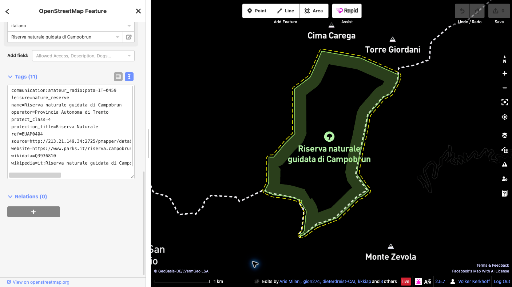

# Aggiungere un riferimento POTA a OpenStreetMap

Questa guida spiega come collegare un elemento esistente di OpenStreetMap (OSM) relativo a un parco al suo riferimento Parks on the Air (POTA).

## Esempio della guida

**Campobrun Natura 2000** — ID POTA **IT-0459**. Verifica l’area nella [scheda ufficiale POTA](https://pota.app/#/park/IT-0459).

## Prima di iniziare

Per caricare modifiche serve un account OpenStreetMap attivo. Se non ne hai uno, [registrati prima](https://www.openstreetmap.org/user/new), poi accedi. Questa guida usa l’editor iD nel browser.

## Procedura

1. **Verifica il parco.** Cerca Campobrun su OSM e controlla nome, estensione e tag esistenti dell’elemento che rappresenta l’intera area protetta. Un’area protetta può essere mappata come relazione multipoligono o come way chiusa.
2. **Seleziona l’elemento completo.** In iD, ingrandisci la mappa e seleziona l’area del parco. Se hai selezionato una way membro, apri la relazione che rappresenta l’area protetta. Non aggiungere il tag a tutte le way del confine.
3. **Aggiungi un solo tag.** Nel pannello dell’elemento apri **Tutti i tag** (la dicitura può variare leggermente secondo la versione di iD) e aggiungi esattamente:

   `communication:amateur_radio:pota=IT-0459`

   Non modificare i tag esistenti né la geometria. Non creare un nuovo punto o confine per il codice POTA. Se il tag POTA esiste già o l’elemento non è chiaro, fermati e chiedi alla comunità OSM locale.

   

4. **Salva la bozza e controllala.** Fai clic su **Salva** per aprire il pannello di caricamento. Leggi l’elenco completo delle modifiche in sospeso e verifica che contenga soltanto il tag POTA previsto sull’elemento corretto. Inserisci un commento descrittivo per il changeset, ad esempio: `Aggiunto il riferimento POTA IT-0459 a Campobrun Natura 2000`.
5. **Dai la conferma finale.** Prima del caricamento, verifica che l’elemento selezionato rappresenti l’intera area protetta, che chiave e valore siano esattamente `communication:amateur_radio:pota=IT-0459` e che geometria e altri tag siano invariati. Leggi eventuali avvisi. Se qualcosa non è corretto, annulla e modifica la bozza. Quando tutto è corretto, fai clic su **Carica** per pubblicare la modifica su OSM. Il caricamento è la conferma pubblica definitiva.
6. **Verifica la modifica pubblicata.** Quando iD conferma il caricamento, riapri l’elemento su OSM e controlla che il tag sia presente. Se il caricamento non riesce, segui il messaggio d’errore e riprova solo dopo aver ricontrollato le modifiche. La mappa POTA potrebbe aggiornarsi dopo qualche minuto.

## Collegamenti

- [Scheda ufficiale POTA IT-0459](https://pota.app/#/park/IT-0459)
- [Area protetta su OpenStreetMap](https://www.openstreetmap.org/way/236761019)
- [Conferma pubblica del changeset](https://www.openstreetmap.org/changeset/189121840)
- [Crea un account OpenStreetMap](https://www.openstreetmap.org/user/new)
- [Wiki OpenStreetMap: `communication:amateur_radio`](https://wiki.openstreetmap.org/wiki/Key:communication:amateur_radio)
