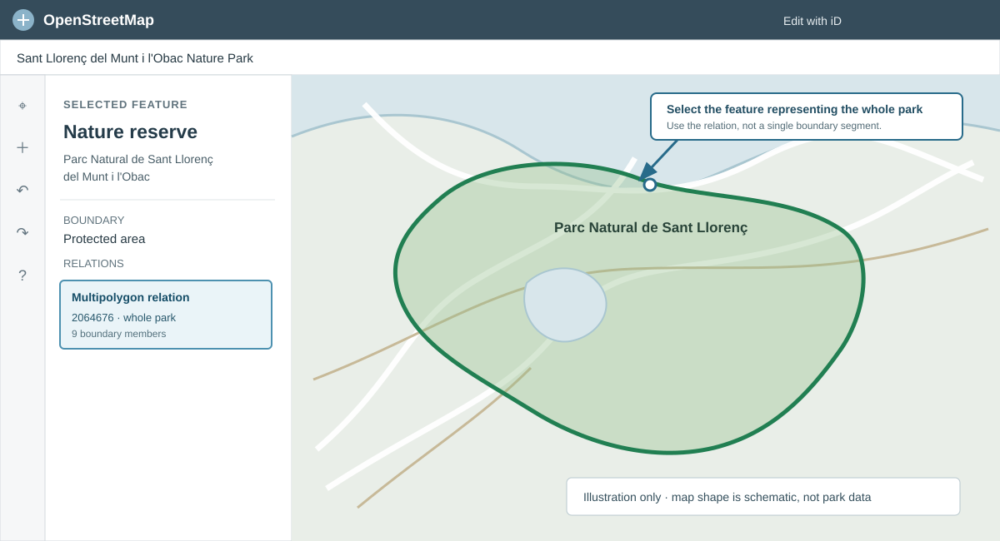
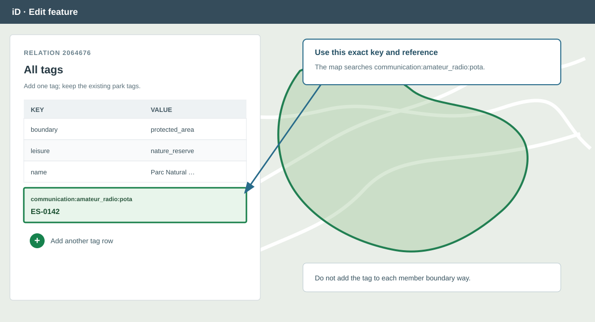
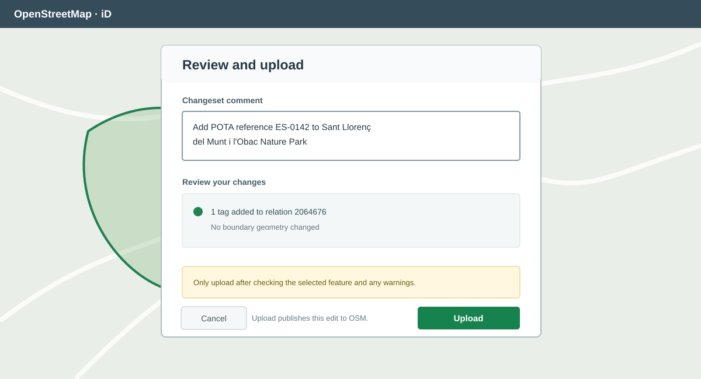

# Add a POTA reference to OpenStreetMap

This guide shows how to link a Parks on the Air (POTA) reference to the existing OpenStreetMap (OSM) feature for that park. The OSM-POTA-Map reads the tag `communication:amateur_radio:pota` from OpenStreetMap data.

The worked example is **Sant Llorenç del Munt i l'Obac Nature Park**, POTA reference **ES-0142**. The park is already represented in OSM by [relation 2064676](https://www.openstreetmap.org/relation/2064676), a protected-area multipolygon. Add the reference to that relation, not to each of its boundary ways.

> **Use the existing park feature.** Do not draw a new point or boundary just to add a POTA reference. Keep the park's existing geometry and tags. If you cannot confirm which OSM feature represents the park, ask the local OSM community before editing.

## What to add

Open the [official POTA listing for ES-0142](https://pota.app/#/park/ES-0142) and confirm the reference belongs to the park. On the matching OSM park feature, add one tag:

| Key | Value |
| --- | --- |
| `communication:amateur_radio:pota` | `ES-0142` |

The OpenStreetMap Wiki describes this key as associating an OSM feature with its POTA code. The map queries this exact key; a tag such as `pota=ES-0142` will not be picked up.

## Edit with the OSM iD editor

You need an OpenStreetMap account to upload an edit. Sign in at [openstreetmap.org](https://www.openstreetmap.org/) using your own account.

### 1. Open the park in OSM

For this example, open [relation 2064676](https://www.openstreetmap.org/relation/2064676). Check its name and park boundary. Its existing tags include `boundary=protected_area`, `leisure=nature_reserve`, and the Catalan park name.

*Illustration of the iD editing view. The OSM boundary should already exist and match the park.*

### 2. Open iD and select the whole-park feature

On the OpenStreetMap page, choose **Edit** → **Edit with iD**. If you started from the relation page, iD opens near the park. Otherwise search the map for the park name and zoom in.

Select the area for the park. If iD selects one of the boundary ways, use the **Relations** section in its feature panel to open the containing multipolygon relation. Confirm the relation represents the whole park before changing it. For the worked example, the relation is **2064676**; its member ways form the park boundary.

### 3. Add the POTA tag

In the selected relation's feature panel, open **All tags** (the label may vary slightly by iD version), then add a row with the exact key and value below. Leave the existing tags unchanged.

| Key | Value |
| --- | --- |
| `communication:amateur_radio:pota` | `ES-0142` |

Do not add the tag to every member way or create a separate point for the POTA reference. If the relation already has this key, check the current value before editing. If the reference appears to conflict with another park code, stop and ask for local mapping advice rather than replacing or combining values.

### 4. Review and upload

Review iD's warnings and make sure the change only adds the POTA tag to the park relation. Click **Save**, add a clear changeset comment, then upload. For this example, use:

> Add POTA reference ES-0142 to Sant Llorenç del Munt i l'Obac Nature Park

The upload is a public edit to OpenStreetMap. Do not upload if you are unsure that the selected relation is the right park feature.

*Illustration of the review and upload step. Do not change park geometry as part of this tag-only edit.*

## Check the result

After upload, reopen [relation 2064676](https://www.openstreetmap.org/relation/2064676) and verify that it lists `communication:amateur_radio:pota=ES-0142`. The OSM-POTA-Map gets data through Overpass, so the new marker may take a little while to appear. Reload or move the map to trigger a fresh query.

## References

- [OpenStreetMap Wiki: `communication:amateur_radio`](https://wiki.openstreetmap.org/wiki/Key:communication:amateur_radio)
- [LearnOSM: the iD editor](https://learnosm.org/en/beginner/id-editor/)
- [POTA park ES-0142](https://pota.app/#/park/ES-0142)
- [OpenStreetMap relation 2064676](https://www.openstreetmap.org/relation/2064676)
